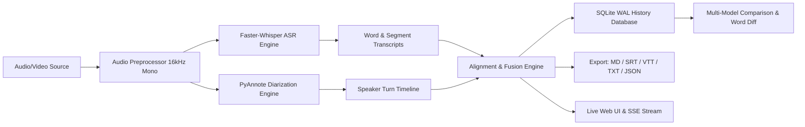

# Transcribe: AI Speech Recognition, Diarization & Model Comparison

[](https://www.python.org/)
[](https://github.com/SYSTRAN/faster-whisper)
[](https://github.com/pyannote/pyannote-audio)
[](https://fastapi.tiangolo.com/)
[](LICENSE)

A high-performance, offline-first speech recognition and speaker diarization engine ("who spoke when"). Powered by **Faster-Whisper** (CTranslate2) for accelerated transcription, **PyAnnote.Audio** for speaker turn identification, and an embedded **Multi-Model Storage & Side-by-Side Comparison Engine**.

---

## Key Features

- **⚡ High-Throughput ASR**: GPU/CPU-accelerated transcription using Faster-Whisper with word-level timestamps, Silero-VAD filtering, and automatic language detection.
- **👥 Speaker Diarization**: Turn-by-turn speaker identification using PyAnnote 3.1 (with clustering fallback), allowing exact speaker attribution.
- **⚖️ Multi-Model Benchmarks & Comparison**:
  - Model Catalog with **33 registered ASR architectures** spanning standard Whisper, English `.en`, Distil-Whisper, Turbo, and Indonesian fine-tunes (`cahya-whisper-*-id-ct2`).
  - Automated benchmark suite ([`scripts/benchmark_all_models.py`](file:///home/aiserver/LABS/AI-VOICE/audio-to-transcription/scripts/benchmark_all_models.py)) evaluating 19 model architectures across 3 quantization modes (`float16`, `int8_float16`, `int8`).
  - Store independent runs across different Whisper model sizes for the same audio source in SQLite.
  - Side-by-side split view with **word-diff highlighting** (additions, deletions, and substitutions).
  - Quantitative benchmark cards: **Similarity %**, **Processing Speed / RTF**, **Word Count Delta**, and **Speaker Counts**.
  - 1-click model re-run chips for zero-effort multi-model comparisons.
- **🚀 Zero-Latency History & Caching**: SQLite storage with Write-Ahead Logging (`WAL`), compound indexes, and client-side Stale-While-Revalidate caching for instantaneous UI rendering.
- **🌐 Universal Ingestion**: Ingest local files or download audio directly from **URLs, YouTube (`yt-dlp`), and Google Drive (`gdown`)**.
- **📋 Multi-Format Export**: Export to **Markdown** (`.md`), **Subtitles** (`.srt`, `.vtt`), **Plain Text** (`.txt`), and **JSON** (`.json`).
- **📡 Real-Time SSE Progress Streaming**: Server-Sent Events delivering live stage progress (`downloading`, `audio_prep`, `vad_scan`, `transcribing`, `done`).
- **💻 CLI & Python Library**: Rich terminal interface (`transcribe` / `audio-transcribe`) and clean programmatic Python APIs.

---

## Pipeline Architecture



---

## Quick Start

### 1. Prerequisites

- Python `>=3.10, <3.13`
- [`uv`](https://github.com/astral-sh/uv) (recommended) or `pip`
- `ffmpeg` installed on your system:
  ```bash
  # Ubuntu / Debian
  sudo apt install ffmpeg
  ```

### 2. Installation

Clone the repository and install dependencies using `uv`:

```bash
git clone https://github.com/abdshomad/transcribe.git
cd transcribe

# Install dependencies
uv sync
```

### 3. Environment Configuration

Copy the example environment file:

```bash
cp .env.example .env
```

To enable **PyAnnote Diarization**, accept the user conditions on [pyannote/speaker-diarization-3.1](https://huggingface.co/pyannote/speaker-diarization-3.1) and set your Hugging Face token in `.env`:
```bash
HF_TOKEN="hf_your_token_here"
PORT=4013
HOST=0.0.0.0
```

---

## Usage Guide

### 1. Web Application

Launch the FastAPI web server:

```bash
# Using the launcher script
./scripts/run-server.sh

# Or directly with uv
uv run python -m transcribe.server
```

Open your browser and navigate to:
```
http://localhost:4013
```

#### Web Features:
* **Drag-and-Drop & URL Input**: Upload audio files or paste Google Drive / YouTube links.
* **1-Click Model Runner Chips**: After completing a run, click `[Tiny]`, `[Base]`, `[Small]`, `[Medium]`, or `[Large-v3]` in the banner to benchmark quality vs. speed.
* **⚖️ Compare Models Modal**: Select any audio source with multiple runs to view side-by-side text diffs and benchmark cards.
* **Live Speaker Rename**: Rename speaker tags globally with instant sync across all export formats.
* **Instant History Drawer**: View saved runs grouped by audio source with 0ms load delay.

---

### 2. Command Line Interface (CLI)

Run transcription directly from your terminal:

```bash
# Transcribe local audio
uv run transcribe data/sample/proklamasi.wav --output-dir ./output

# Specify model and speaker count
uv run transcribe input.mp3 --model large-v3 --speakers 2 --export-format srt

# Transcribe directly from a remote URL
uv run transcribe "https://www.youtube.com/watch?v=..." --output-dir ./output
```

#### CLI Options:
| Option | Short | Description | Default |
| :--- | :---: | :--- | :--- |
| `--model` | `-m` | Whisper model size (`tiny`, `base`, `small`, `medium`, `large-v3`) | `base` |
| `--language` | `-l` | Language code (`en`, `id`, `es`, etc.) or `auto` | `auto` |
| `--device` | `-d` | Compute device (`cuda`, `cpu`, `auto`) | `auto` |
| `--diarize / --no-diarize` | | Enable or disable speaker diarization | `True` |
| `--speakers` | | Exact number of speakers (if known) | `None` |
| `--export-format` | `-f` | Format (`all`, `json`, `srt`, `vtt`, `txt`, `tsv`) | `all` |
| `--output-dir` | `-o` | Output directory for transcripts | `./output` |

---

### 3. REST & Streaming API

| Endpoint | Method | Description |
| :--- | :---: | :--- |
| `/api/transcribe-stream` | `POST` | Real-time SSE stream for transcription progress & segments |
| `/api/sources` | `GET` | List audio sources grouped with their model runs |
| `/api/compare` | `GET` | Compare two runs (`?job_a=...&job_b=...`) with word diffs and metrics |
| `/api/history` | `GET` | Retrieve all historical transcription records |
| `/api/history/{job_id}` | `GET` | Retrieve full result JSON for a specific run |
| `/api/history/{job_id}` | `PATCH` | Update segment edits or speaker renames |
| `/api/history/{job_id}` | `DELETE` | Delete a single history record |
| `/api/history` | `DELETE` | Clear all history records |

#### Example: Transcribe via cURL
```bash
curl -N -X POST "http://localhost:4013/api/transcribe-stream" \
  -F "source_name=proklamasi.wav" \
  -F "model=tiny" \
  -F "language=id"
```

#### Example: Compare Two Model Runs
```bash
curl -s "http://localhost:4013/api/compare?job_a=job_101&job_b=job_102"
```

---

### 4. Python API

```python
from transcribe.pipeline import AudioTranscriptionPipeline
from transcribe.history import compare_runs

# Initialize pipeline
pipeline = AudioTranscriptionPipeline(
    whisper_model_size="base",
    device="auto",
    enable_diarization=True,
)

# Process audio
result = pipeline.process("data/sample/proklamasi.wav", language="id")

print(f"Language: {result.language} | Duration: {result.duration:.2f}s")
for seg in result.segments:
    print(f"[{seg.speaker}] {seg.start:.2f}s -> {seg.end:.2f}s: {seg.text}")
```

---

## Directory Structure

```text
transcribe/
├── docs/                      # Technical Documentation, Specs & Benchmarks
│   ├── features/              # Feature domain documentation
│   │   ├── core/              # ASR models, architecture, benchmarks
│   │   ├── comparison/        # Multi-model comparison engine
│   │   ├── ingestion/         # Audio & video ingestion
│   │   ├── interface/         # Web UI & CLI specs
│   │   └── storage/           # SQLite & caching layer
│   ├── prd/                   # Product requirements document
│   └── youtube/               # Voice AI landscape & playlist research
├── plans/                     # Development roadmap & active focus
├── scripts/
│   ├── benchmark_all_models.py# Comprehensive 19-model multi-quantization benchmark
│   ├── run-server.sh          # Web server launcher script
│   ├── whisper-cli            # Direct CLI wrapper
│   └── youtube/               # YouTube Voice AI playlist scraper & synchronizer
├── src/transcribe/            # Core Python package
│   ├── __init__.py
│   ├── aligner.py             # Temporal intersection & speaker alignment
│   ├── audio.py               # Audio loader & FFmpeg resampler
│   ├── cli.py                 # Typer/Rich command-line interface
│   ├── diarizer.py            # PyAnnote 3.1 & clustering backend
│   ├── downloader.py          # URL, YouTube, GDrive ingestion
│   ├── exporters.py           # JSON, SRT, VTT, TXT serializers
│   ├── history.py             # SQLite WAL persistence & comparison engine
│   ├── metrics.py             # WER, CER, RTF calculation engine
│   ├── models.py              # Pydantic data schemas & 33-model catalog
│   ├── pipeline.py            # Unified orchestrator
│   ├── server.py              # FastAPI REST & SSE streaming server
│   ├── transcriber.py         # Faster-Whisper CTranslate2 engine & Indonesian aliases
│   ├── web.py                 # Tailwind CSS web UI & diff visualizer
│   └── youtube.py             # YouTube playlist parser
├── tests/                     # Unit and integration test suite
├── pyproject.toml             # Package metadata & entry points
└── README.md
```

---

## Testing

Run the full automated test suite:

```bash
uv run pytest
```

---

## License

This project is licensed under the [MIT License](LICENSE).