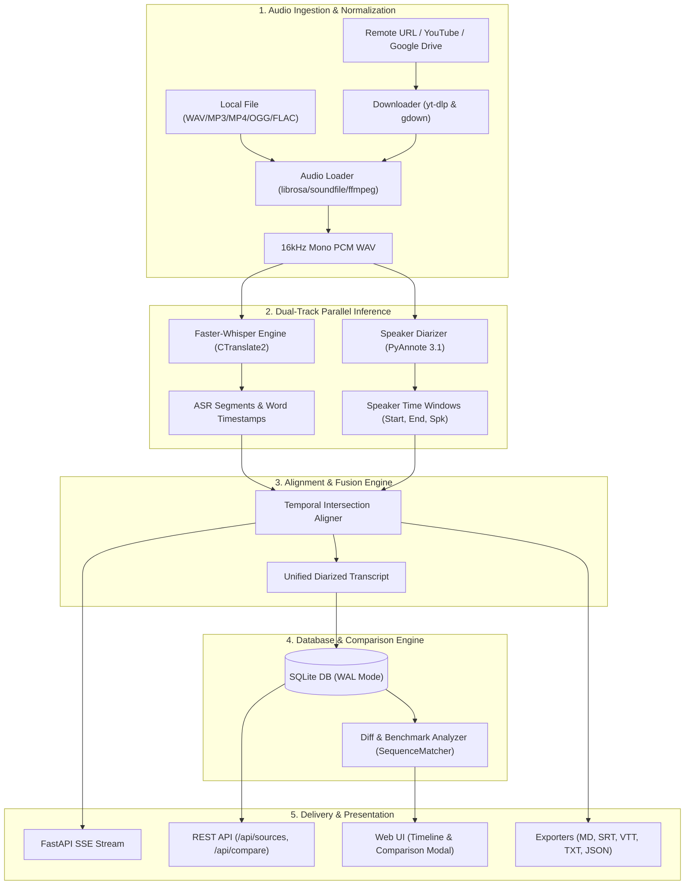
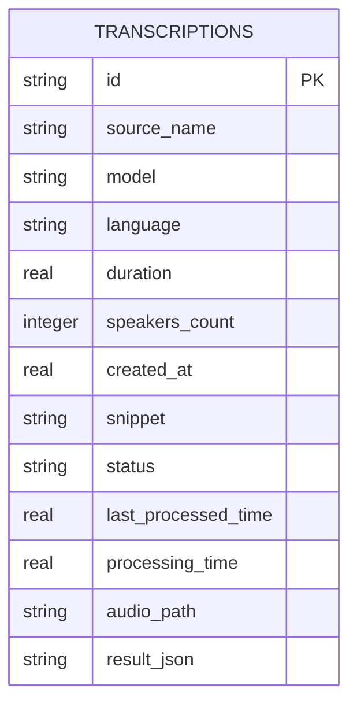

# System Architecture

## Overview
Transcribe is built as a modular, high-performance audio processing, diarization, and comparison system. It decouples audio ingestion, speech recognition, speaker clustering, database persistence, and user interfaces into independent services.

---

## 1. System Pipeline Architecture

---

## 2. Component Specifications

### 2.1 Package Structure (`src/transcribe/`)

| Module | Responsibility | Key Classes / Functions |
| :--- | :--- | :--- |
| [`transcribe.audio`](../../../src/transcribe/audio.py) | Audio ingestion, format conversion, 16kHz mono resampling | `load_and_resample_audio`, `normalize_audio` |
| [`transcribe.downloader`](../../../src/transcribe/downloader.py) | Remote URL, YouTube (`yt-dlp`), Google Drive (`gdown`) fetcher | `download_audio`, `is_url` |
| [`transcribe.transcriber`](../../../src/transcribe/transcriber.py) | Faster-Whisper ASR inference wrapper with VAD | `FasterWhisperTranscriber`, `transcribe_audio` |
| [`transcribe.diarizer`](../../../src/transcribe/diarizer.py) | PyAnnote speaker diarization & fallback clustering | `PyAnnoteDiarizer`, `diarize_audio` |
| [`transcribe.aligner`](../../../src/transcribe/aligner.py) | Word-level & segment temporal intersection mapping | `align_transcription_and_diarization` |
| [`transcribe.pipeline`](../../../src/transcribe/pipeline.py) | High-level orchestrator for end-to-end processing | `AudioTranscriptionPipeline.process()` |
| [`transcribe.history`](../../../src/transcribe/history.py) | SQLite WAL persistence, multi-model storage, comparison | `save_history`, `list_sources`, `compare_runs` |
| [`transcribe.exporters`](../../../src/transcribe/exporters.py) | Subtitle and document serializers (JSON, SRT, VTT, TXT) | `export_to_srt`, `export_to_vtt`, `export_to_txt` |
| [`transcribe.server`](../../../src/transcribe/server.py) | FastAPI REST server, SSE progress streaming | `transcribe_audio_stream` |
| [`transcribe.models`](../../../src/transcribe/models.py) | Pydantic data schemas, 33-model catalog & specs | `MODEL_CATALOG`, `TranscriptionResult` |
| [`transcribe.metrics`](../../../src/transcribe/metrics.py) | Normalized WER, CER, and Real-Time Factor (RTF) calculations | `calculate_wer`, `calculate_cer`, `calculate_rtf` |
| [`transcribe.youtube`](../../../src/transcribe/youtube.py) | YouTube playlist metadata extractor & research sync | `fetch_playlist_videos` |
| [`transcribe.web`](../../../src/transcribe/web.py) | Tailwind CSS & JavaScript single-page web UI | `HTML_PAGE` |
| [`transcribe.cli`](../../../src/transcribe/cli.py) | Rich/Typer command-line interface | `transcribe.cli:main` |

---

## 3. Database Schema & Indexing

* **Storage Engine**: SQLite 3 with Write-Ahead Logging (`PRAGMA journal_mode = WAL;`) and synchronous normal mode (`PRAGMA synchronous = NORMAL;`).
* **Indexes**:
  * `idx_transcriptions_created_at` on `transcriptions (created_at DESC)` for instantaneous reverse-chronological list rendering.
  * `idx_transcriptions_source` on `transcriptions (source_name)` for grouping runs across models.

---

## 4. Multi-Model Comparison & Benchmarking

The comparison engine in [`../../../src/transcribe/history.py`](../../../src/transcribe/history.py) takes any two job IDs ($Job_A$ and $Job_B$) for the same audio source and performs:

1. **Normalized Token Diffing**:
   Tokens are stripped of surrounding punctuation and case-normalized to compute accurate sequence alignment opcodes:
   $$\text{Tag} \in \{\text{equal}, \text{delete}, \text{insert}, \text{replace}\}$$
2. **Text Similarity Metric**:
   $$\text{Similarity \%} = \frac{2 \times M}{T_A + T_B} \times 100$$
   where $M$ is matching word tokens, and $T_A, T_B$ are total words in each run.
3. **Speedup & Real-Time Factor (RTF)**:
   $$\text{Speedup Ratio} = \frac{\max(\text{Time}_A, \text{Time}_B)}{\min(\text{Time}_A, \text{Time}_B)}$$
   $$\text{RTF}_X = \frac{\text{Audio Duration}}{\text{Processing Time}}$$

---

## 5. API & Communication Contract

### Real-Time SSE Stream (`POST /api/transcribe-stream`)
Yields standard Server-Sent Events with JSON payloads:
* `{"type": "progress", "data": {"stage": "downloading", "percent": 45.2, "downloaded": 4500000, "total": 10000000}}`
* `{"type": "progress", "data": {"stage": "audio_prep", "message": "Normalizing Audio (16kHz WAV)..."}}`
* `{"type": "progress", "data": {"stage": "vad_scan", "duration": 48.5}}`
* `{"type": "progress", "data": {"stage": "transcribing", "current_time": 14.2, "percent": 29.3, "segment": {...}}}`
* `{"type": "done", "job_id": "job_123", "data": {...}, "processing_time": 4.66}`
* `{"type": "error", "error": "Reason"}`
