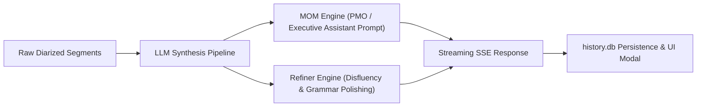

# Local AI Intelligence: MOM Synthesis & Transcript Refinement

> **Domain**: Post-Processing, Executive Synthesis & AI Polishing  
> **Status**: `CONFIGURABLE / EXPERIMENTAL` ⚙️  
> **Related Implementations**: [`../../../src/transcribe/mom.py`](../../src/transcribe/mom.py), [`../../../src/transcribe/refiner.py`](../../src/transcribe/refiner.py), [`../../../scripts/llm_server.sh`](../../scripts/llm_server.sh)

---

## Architecture Overview

Transcribe integrates with local high-performance LLM engines (such as FreeToken on NVIDIA GPUs) using an OpenAI-compatible SSE streaming interface.

---

## Key Modules

### 1. Minutes of Meeting (MOM) Engine (`src/transcribe/mom.py`)
- Formats multi-speaker diarized segments (`Speaker: Text`).
- Synthesizes structured Minutes of Meeting:
  - **Meeting Overview**: Topic, Date, Key Attendees.
  - **Executive Summary**: Core meeting purpose and high-level outcomes.
  - **Key Discussion Points**: Categorized thematic breakdowns.
  - **Decisions Made**: Binding conclusions and ratified consensus.
  - **Action Items & Next Steps**: Markdown table with Task, Owner, and Deadline.
- **Language Invariant**: Enforces strict native language preservation without translating speaker statements.

### 2. Transcript Refinement Layer (`src/transcribe/refiner.py`)
- Polishes disfluencies, false starts, and filler words (`um`, `uh`, `anu`, `gitu`).
- Corrects punctuation, casing, and sentence boundaries while preserving technical terminology and 100% native vocabulary.

### 3. Server Launcher (`./scripts/llm_server.sh`)
- Manages local LLM inference lifecycle on dedicated GPU hardware (GPU 1, Port 4050).
- Configurable via `.env` (`LLM_MODEL`, `LLM_BASE_URL`, `LLM_PORT`).
