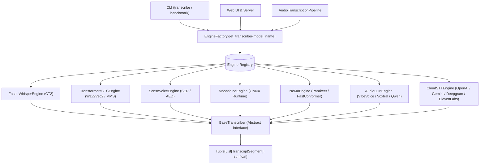

# Technical Specification: Multi-Engine Polymorphic ASR Architecture

## 1. Overview & Motivation
Currently, transcription execution is driven through Faster-Whisper (CTranslate2). To expand support to heterogeneous speech architectures—including **Transformers CTC** (Wav2Vec2, MMS), **ONNX Edge Runtimes** (Moonshine), **Alibaba FunAudioLLM** (SenseVoice), **NVIDIA NeMo** (Parakeet, Nemotron), **Audio-LLMs** (VibeVoice, Voxtral, Qwen3-Audio), and **Cloud APIs** (OpenAI, Gemini, Deepgram, ElevenLabs, AWS)—the system requires a decoupled, polymorphic engine registry.

---

## 2. Architecture Diagram



---

## 3. Core Abstract Interface (`src/transcribe/engines/base.py`)

```python
from abc import ABC, abstractmethod
from typing import Callable, List, Optional, Tuple
from transcribe.models import TranscriptSegment

class BaseTranscriber(ABC):
    """Abstract base class for all ASR engines."""
    
    @abstractmethod
    def __init__(
        self,
        model_name: str,
        device: str = "auto",
        compute_type: str = "default",
        **kwargs
    ):
        pass

    @abstractmethod
    def transcribe(
        self,
        audio_path: str,
        language: Optional[str] = None,
        beam_size: int = 5,
        vad_filter: bool = True,
        on_segment: Optional[Callable[[TranscriptSegment], None]] = None,
        **kwargs
    ) -> Tuple[List[TranscriptSegment], str, float]:
        """
        Execute transcription on preprocessed 16kHz audio.
        Returns: (segments, detected_language, language_probability)
        """
        pass
```

---

## 4. Engine Categories & Implementation Specifications

### Category 1: Faster-Whisper & Distil-Whisper (`src/transcribe/engines/faster_whisper.py`)
- **Models**: Standard Whisper (`tiny` -> `large-v3`, `turbo`), English `.en`, Distil-Whisper (`distil-*`), Indonesian CT2 fine-tunes.
- **Backend**: CTranslate2 CUDA/CPU with Silero-VAD and word-level dynamic time warping.

### Category 2: Hugging Face Transformers Acoustic CTC (`src/transcribe/engines/transformers_ctc.py`)
- **Models**: `indonesian-wav2vec2-regional`, `indonesian-wav2vec2-large-xlsr`, `meta-omnilingual-asr` (Meta MMS 1B).
- **Backend**: `transformers.Wav2Vec2ForCTC` / `Wav2Vec2Processor` with chunked 30s windowing and CTC greedy decoding.

### Category 3: Alibaba FunAudioLLM SenseVoice (`src/transcribe/engines/sensevoice.py`)
- **Models**: `sensevoice-small` (`FunAudioLLM/SenseVoiceSmall`).
- **Capabilities**: 50x RTF transcription, Speech Emotion Recognition (SER), and Audio Event Detection (AED) tag parsing (`<|HAPPY|>`, `<|LAUGHTER|>`, `<|APPLAUSE|>`).

### Category 4: UsefulSensors Moonshine ONNX Edge (`src/transcribe/engines/moonshine.py`)
- **Models**: `moonshine-tiny`, `moonshine-base`.
- **Backend**: `onnxruntime` executing encoder/decoder graph without PyTorch dependency for ultra-low latency edge devices.

### Category 5: Cloud Hosted STT APIs (`src/transcribe/engines/cloud/`)
- **Providers**:
  - `OpenAIWhisperEngine`: `https://api.openai.com/v1/audio/transcriptions`
  - `GoogleGeminiAudioEngine`: Google GenAI SDK (Gemini 2.5 Flash Audio)
  - `DeepgramEngine`: Deepgram REST / WebSocket Nova-2 API
  - `ElevenLabsScribeEngine`: ElevenLabs Scribe v2 SOTA diarized ASR
  - `AmazonTranscribeEngine`: AWS SDK `boto3` batch job runner

### Category 6: NVIDIA NeMo FastConformer & RNN-T (`src/transcribe/engines/nemo.py`)
- **Models**: `nvidia-parakeet-tdt-v3`, `nvidia-nemotron-speech-asr`.
- **Backend**: NVIDIA NeMo toolkit with FastConformer CTC/TDT decoders and cache-aware streaming.

### Category 7: Long-Form & Audio-LLM Unified Engines (`src/transcribe/engines/audio_llm.py`)
- **Models**: `microsoft-vibevoice-asr`, `kyutai-stt`, `voxtral-mini-3b`, `moss-sats-diarized-asr`, `qwen3-audio-stt`, `tencent-covo-audio-7b`.
- **Backend**: Single-pass 60-minute context window and autoregressive speech-to-text generation.

---

## 5. Dynamic Engine Dispatch Factory (`src/transcribe/engines/factory.py`)

```python
from typing import Dict, Type
from transcribe.engines.base import BaseTranscriber

ENGINE_MAP: Dict[str, str] = {
    # Whisper & Distil & CT2
    "tiny": "transcribe.engines.faster_whisper.FasterWhisperEngine",
    "base": "transcribe.engines.faster_whisper.FasterWhisperEngine",
    "cahya-whisper-small-id": "transcribe.engines.faster_whisper.FasterWhisperEngine",
    # Wav2Vec2 & MMS
    "indonesian-wav2vec2-regional": "transcribe.engines.transformers_ctc.TransformersCTCEngine",
    "meta-omnilingual-asr": "transcribe.engines.transformers_ctc.TransformersCTCEngine",
    # SenseVoice
    "sensevoice-small": "transcribe.engines.sensevoice.SenseVoiceEngine",
    # Moonshine
    "moonshine-base": "transcribe.engines.moonshine.MoonshineEngine",
    # Cloud
    "openai-whisper-api": "transcribe.engines.cloud.openai.OpenAIWhisperEngine",
    "google-omni-api": "transcribe.engines.cloud.gemini.GoogleGeminiAudioEngine",
    "deepgram-nova-2": "transcribe.engines.cloud.deepgram.DeepgramEngine",
}

def get_transcriber(model_name: str, device: str = "auto", **kwargs) -> BaseTranscriber:
    """Instantiate appropriate transcriber engine via lazy dynamic import."""
    ...
```
