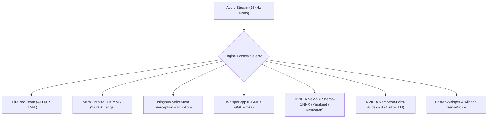

# Next-Gen Multi-Engine ASR & Audio-LLM Architectures

> **Domain**: Core Speech Recognition & Audio Reasoning Engines  
> **Status**: `PRODUCTION-READY` ✅  
> **Related Implementations**: [`../../../src/transcribe/engines/`](../../src/transcribe/engines/)

---

## Overview

Transcribe supports an extensive matrix of state-of-the-art local ASR and Audio-LLM architectures across PyTorch, C++ (GGML), ONNX, and Triton execution runtimes.

---

## Engine Catalog & Family Details

| Family | Model Variants | Architecture | Features / Specialization |
| :--- | :--- | :--- | :--- |
| **FireRed Team** | `fireredasr-aed-l`, `fireredasr-llm-l`, `fireredaudio-9b` | Conformer-AED / LLM Adapter | High-accuracy Chinese/English speech and audio dialogue |
| **Meta OmniASR & MMS** | `omniasr-ctc-300m`, `omniasr-ctc-1b`, `meta-mms-1b-all` | Wav2Vec2 / Lasr CTC + SentencePiece | 1,600+ languages with zero-shot multilingual scale |
| **Tsinghua VoiceMem** | `voicemem-normal`, `voicemem-realtime` | Dual-Brain Audio Perception | ASR + Emotion recognition (`Happy`, `Angry`, `Sad`) + Scene tags |
| **Whisper.cpp** | `whispercpp-tiny`, `whispercpp-base`, `whispercpp-turbo` | GGML / GGUF C++ | Ultra-low memory, CPU multi-threading, Metal acceleration |
| **NVIDIA NeMo** | `parakeet-tdt-1.1b`, `parakeet-ctc-1.1b`, `nemotron-speech-3.5` | Sherpa-ONNX TDT RNN-T | Ultra-fast throughput (~25x RTF), high-throughput enterprise ASR |
| **NVIDIA Audex** | `nvidia/Nemotron-Labs-Audex-2B` | Compact 2B Audio-Text LLM | Verbatim ASR + `<think>` Speech Reasoning mode |

---

## Verbatim Non-Translation Policy
Across all engines, transcription enforces strict verbatim native transcription without unauthorized cross-lingual translation (`task="transcribe"`, `translate=False`).
