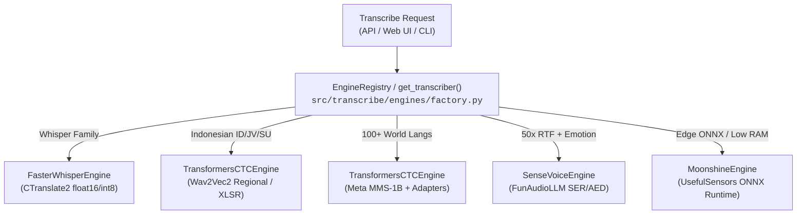

# 🎙️ Polymorphic Local ASR Engine Architecture

> **Domain**: Core Transcription & Speech-to-Text  
> **Status**: `PRODUCTION-READY` ✅  
> **Hardware Support**: NVIDIA CUDA GPU (L40 / RTX 30/40) & x86_64 CPU  
> **Execution Strategy**: 100% Local Self-Hosted Execution with Zero Cloud Dependencies  

---

## 1. Executive Summary

Transcribe features a fully polymorphic, multi-engine speech recognition architecture. Instead of being coupled to a single model runtime, the system dynamically instantiates the optimal engine backend based on model identifier, dialect requirement, performance profile, and hardware target:



---

## 2. Supported Local Engine Families

### 2.1 Faster-Whisper (`CTranslate2`)
* **Module**: [`../../../src/transcribe/engines/faster_whisper.py`](../../../src/transcribe/engines/faster_whisper.py)
* **Models**: `tiny`, `tiny.en`, `base`, `base.en`, `small`, `small.en`, `medium`, `medium.en`, `large-v1`, `large-v2`, `large-v3`, `turbo`, `distil-small.en`, `distil-medium.en`, `distil-large-v2`, `distil-large-v3`, `cahya-whisper-*`.
* **Strengths**: Maximum throughput, Batched inference, word-level timestamps, VAD filtering.

### 2.2 Indonesian Regional & Dialects (`Wav2Vec2 CTC`)
* **Module**: [`../../../src/transcribe/engines/transformers_ctc.py`](../../../src/transcribe/engines/transformers_ctc.py)
* **Models**:
  * `indonesian-wav2vec2-regional`: Specialized fine-tune for Bahasa Indonesia (`id`), Javanese (`jv`), and Sundanese (`su`).
  * `indonesian-wav2vec2-large-xlsr`: 53-language acoustic representation fine-tuned on Indonesian speech.
* **Decoding**: Sliding-window chunked CTC acoustic inference with zero out-of-memory overhead on long recordings.

### 2.3 Alibaba FunAudioLLM SenseVoice
* **Module**: [`../../../src/transcribe/engines/sensevoice.py`](../../../src/transcribe/engines/sensevoice.py)
* **Model**: `FunAudioLLM/SenseVoiceSmall` (234M params).
* **Capabilities**:
  * **Ultra-Fast Speed**: ~50x Real-Time Factor (RTF).
  * **Speech Emotion Recognition (SER)**: Tags utterances with `<|HAPPY|>`, `<|SAD|>`, `<|ANGRY|>`, `<|NEUTRAL|>`, `<|FEARFUL|>`, `<|DISGUSTED|>`, `<|SURPRISED|>`.
  * **Audio Event Detection (AED)**: Detects `<|LAUGHTER|>`, `<|APPLAUSE|>`, `<|CRY|>`, `<|MUSIC|>`, `<|SNEEZE|>`, `<|COUGH|>`.

### 2.4 UsefulSensors Moonshine (`ONNX Runtime`)
* **Module**: [`../../../src/transcribe/engines/moonshine.py`](../../../src/transcribe/engines/moonshine.py)
* **Models**: `UsefulSensors/moonshine-tiny` (27M) and `UsefulSensors/moonshine-base` (61M).
* **Features**: Variable-length acoustic encoder tailored for edge devices, zero heavy framework dependencies via ONNX Runtime.

### 2.5 Meta MMS Omnilingual (`MMS-1B`)
* **Module**: [`../../../src/transcribe/engines/transformers_ctc.py`](../../../src/transcribe/engines/transformers_ctc.py)
* **Model**: `facebook/mms-1b-all` (1 Billion params).
* **Features**: Dynamic ISO-639-3 adapter swapping supporting 100+ global languages and minority dialects.

---

## 3. Shared Server Storage & Model Downloader

All model weights are downloaded into the shared user cache (`~/.cache/huggingface/hub/`) and symlinked into `data/models/<family>/<variant>`:
```bash
# Parallel download with progress reporting
uv run python scripts/download_models.py --models sensevoice-small moonshine-tiny meta-mms-1b --workers 3
```

---

## 4. Verification & Testing Matrix

The entire engine ecosystem is verified through comprehensive test suites:
* `tests/test_engines_base.py`: Interface contracts and device resolution.
* `tests/test_engines_factory.py`: Lazy dynamic engine routing.
* `tests/test_engines_faster_whisper.py`: Faster-Whisper execution.
* `tests/test_engines_transformers_ctc.py`: CTC windowing & MMS adapter swapping.
* `tests/test_engines_sensevoice.py`: Emotion and audio event detection.
* `tests/test_engines_moonshine.py`: Edge ONNX transcription.
* `tests/test_live_models.py`: Real-weights GPU/CPU live inference.
* `tests/test_server_models.py`: `/api/models` catalog endpoint.
