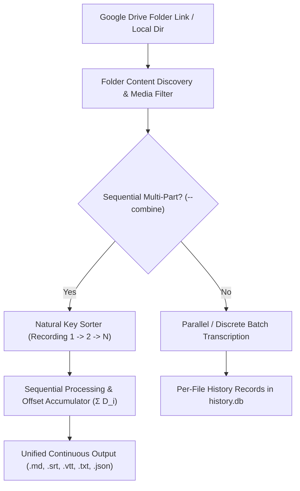

# Google Drive Batch Ingestion & Sequential Folder Merging

> **Domain**: Ingestion, Batch Processing & Continuous Audio Merging  
> **Status**: `PRODUCTION-READY` ✅  
> **Related Implementations**: [`../../../src/transcribe/downloader.py`](../../src/transcribe/downloader.py), [`../../../src/transcribe/merger.py`](../../src/transcribe/merger.py), [`../../../src/transcribe/pipeline.py`](../../src/transcribe/pipeline.py)

---

## Overview

Transcribe provides robust batch ingestion capabilities for Google Drive folders, local multi-file directories, and sequential multi-part meeting recordings.



---

## Key Capabilities

### 1. Google Drive Folder Discovery & Auto-Resume
- **Folder URL Parsing**: Extracts folder ID from standard sharing URLs (`drive.google.com/drive/folders/{id}`).
- **Media Candidate Filtering**: Identifies audio/video extensions (`.m4a`, `.mp3`, `.wav`, `.mp4`, `.mkv`, etc.) or Google Meet recording naming patterns.
- **HTTP Range Auto-Resume**: Automatically resumes interrupted network downloads using `Range: bytes={start}-` headers without re-downloading existing chunks.

### 2. Checkpoint Auto-Resume (`history.db`)
- Interrupted or partially transcribed files track `last_processed_time`.
- Upon re-running a batch, the pipeline detects previous job checkpoints and resumes processing from the exact segment offset.

### 3. Sequential Multi-Part Recording Merging (`--combine`)
- **Natural Ordering**: Sorts multi-part files logically (`extract_sequence_key`, e.g., `Part 1`, `Part 2` or timestamped segments).
- **Cumulative Timestamp Offsets**: Accumulates cumulative durations ($\sum D_i$) so word-level timestamps and diarization segments flow continuously.
- **Unified Exports**: Generates combined `.md`, `.srt`, `.vtt`, `.txt`, and `.json` files representing the complete uninterrupted session.

---

## CLI & Pipeline Usage

```bash
# Ingest entire Google Drive folder with interactive confirmation
transcribe --url "https://drive.google.com/drive/folders/1abc...xyz"

# Ingest and combine multi-part recording sequentially into a single unified transcript
transcribe --url "https://drive.google.com/drive/folders/1abc...xyz" --combine --yes
```
