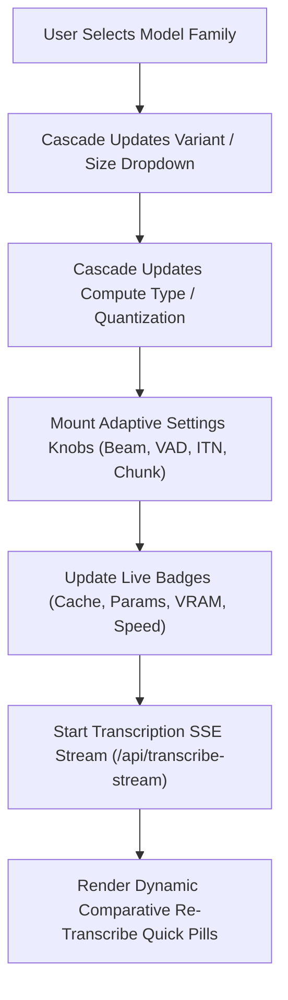

# Universal Web Model Hierarchy Selector & Streaming Pipeline

> **Feature Domain**: Interface / Web UI  
> **Milestone**: `v0.5.0` (`COMPLETED` ✅)  
> **Source Modules**: [`src/transcribe/web.py`](../../../src/transcribe/web.py), [`src/transcribe/models.py`](../../../src/transcribe/models.py), [`src/transcribe/server.py`](../../../src/transcribe/server.py)

---

## 1. Overview & Architecture

The Universal Model Hierarchy Selector transforms the single-model transcription interface into a flexible, dynamic system that supports all polymorphic local speech recognition architectures:

---

## 2. Key Components

### 2.1 Dynamic Cascaded Selectors
- **Architecture / Family**: `Faster-Whisper`, `Alibaba SenseVoice`, `UsefulSensors Moonshine`, `Meta MMS`, `Indonesian CTC`.
- **Variant / Size**: Filtered dynamically per family (e.g. `tiny`, `base`, `small`, `turbo`, `distil-small.en` for Whisper; `moonshine-tiny`, `moonshine-base` for Moonshine).
- **Compute Type / Quantization**: `Auto / Default`, `FP16 (Fast GPU)`, `INT8 (Low VRAM)`, `INT8_FP16 (Hybrid)`.

### 2.2 Live Capability Badges
- **Cache Indicator**: `● Cached` (green) or `📥 Auto-Download` (amber) checked dynamically against local directory and HuggingFace cache.
- **Model Stats**: Parameter counts (`39M` to `1.5B`), estimated VRAM (`~1 GB` to `~4 GB`), and real-time factor speed multiplier (`~8x` to `~50x RTF`).

### 2.3 Contextual Adaptive Settings Knobs
- **Whisper**: Beam Search Size (`1` to `10`) and Silero VAD toggle.
- **SenseVoice**: Inverse Text Normalization (ITN) toggle and Emotion/Event Detection indicator.
- **Meta MMS**: Adapter Language Code input (`ind`, `eng`, `jav`, `sun`, `zlm`, etc.).
- **Indonesian CTC**: Chunk Window Size selector (`15s`, `30s`, `45s`, `60s`).

### 2.4 Comparative 1-Click Retranscribe Bar
Upon transcript completion, the interface dynamically populates quick-switch pills for all size variants of the current family along with top cross-family alternatives, enabling instantaneous model-to-model benchmarking.

---

## 3. End-to-End Visual Verification

All 10 model variants across the 5 local families have been verified using automated Playwright tests with 5 standard lifecycle screenshot captures:
1. `01-initial-state.jpg`: Initial clean UI load.
2. `02-model-configured.jpg`: Cascaded model, size variant, and compute type selected with active badges & adaptive knobs.
3. `03-file-uploaded.jpg`: Audio sample loaded and ready to transcribe.
4. `04-streaming-progress.jpg`: Active SSE streaming with real-time progress bar, live badges, and partial segments.
5. `05-completed-results.jpg`: Completed transcript timeline, speaker badges, and export action bar.

Artifacts are archived in [`screenshots/e2e/`](../../../screenshots/e2e/).
