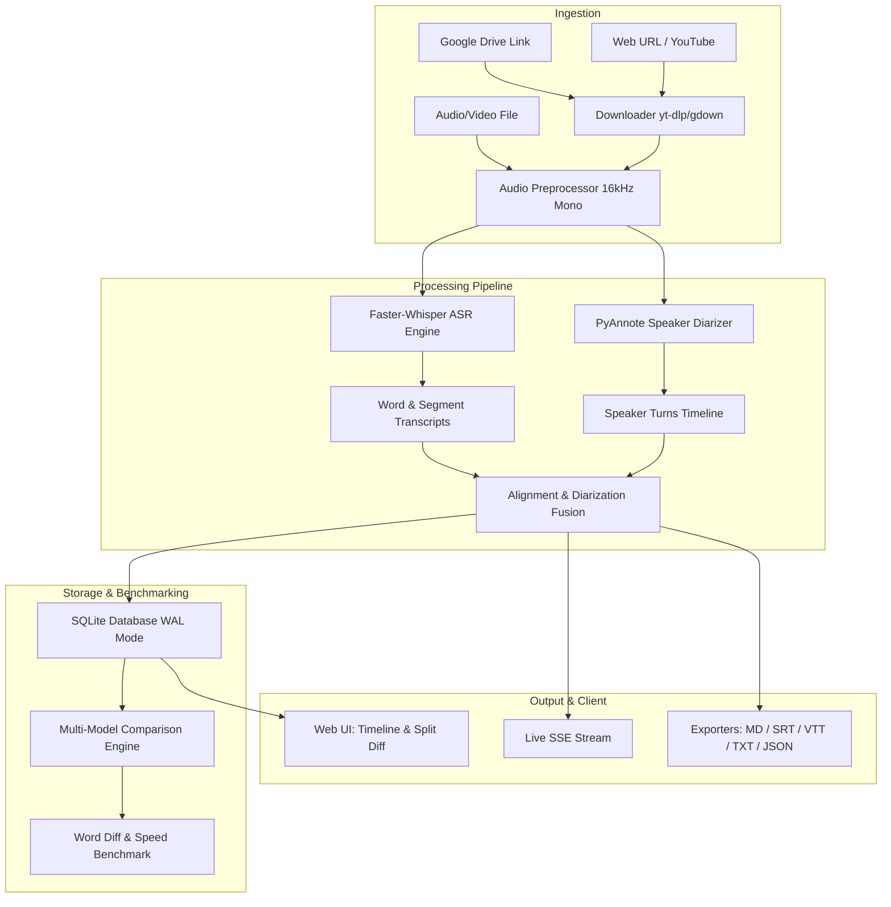

# Product Requirements Document (PRD)

## 1. System Vision
* **Mission**: High-throughput, offline-first audio transcription, speaker diarization, multi-model storage, and side-by-side benchmark comparison platform.
* **Hardware Acceleration**: Automatic CUDA/TensorRT acceleration via CTranslate2 with seamless fallback to multi-threaded CPU processing.
* **Extensibility**: Pluggable Whisper ASR model sizes (`tiny`, `base`, `small`, `medium`, `large-v3`), PyAnnote speaker diarization, and customizable export pipelines.

---

## 2. Core Features & Functional Requirements

### 2.1 Audio Ingestion & Normalization
* **Multi-Source Support**: Local audio/video files (WAV, MP3, MP4, M4A, FLAC, OGG, WEBM), direct web URLs, YouTube (`yt-dlp`), and Google Drive file links (`gdown`).
* **Audio Preprocessing**: Automatic FFmpeg 16kHz mono resampling and volume normalization.
* **Persistent Upload Cache**: Server-side audio persistence in `data/uploads/` and `data/downloads/` allowing zero-reupload re-transcription across multiple model sizes.

### 2.2 Speech-to-Text (ASR) Engine
* **Faster-Whisper Integration**: High-speed CTranslate2 Whisper backend with word-level timestamps and probability scores.
* **Voice Activity Detection (VAD)**: Silero-VAD filtering to prevent hallucination during non-speech segments.
* **Language Handling**: Automatic language detection with manual language specification override (`en`, `id`, `es`, `ja`, etc.).

### 2.3 Speaker Diarization & Temporal Alignment
* **Diarization Pipeline**: PyAnnote 3.1 neural speaker diarization with clustering fallback.
* **Temporal Fusion**: Exact intersection mapping assigning distinct speaker IDs to word tokens and sentence segments.
* **Live Speaker Renaming**: Client-side speaker label customization that automatically synchronizes across all export formats.

### 2.4 Multi-Model Storage & Persistence
* **Independent Run Storage**: SQLite database (`data/history.db`) storing each model run independently with `(id, source_name, model, language, duration, processing_time, speakers_count, result_json)`.
* **Zero-Overwrite Principle**: Preserves historical runs so users can transcribe the same audio with multiple models (e.g. `tiny`, `base`, `small`, `medium`, `large-v3`) and compare outcomes.
* **High-Throughput SQLite**: `PRAGMA journal_mode = WAL;`, `PRAGMA synchronous = NORMAL;`, and compound indexes on `created_at` and `source_name`.

### 2.5 Side-by-Side Model Comparison Engine
* **Sequence Alignment**: Word-level `difflib.SequenceMatcher` token comparison detecting additions, deletions, and substitutions.
* **Benchmark Metrics**:
  * **Text Similarity %**: Exact word sequence matching ratio.
  * **Processing Speed & Speedup**: Wall-clock processing time, real-time factor ($X\times$), and relative speed multiplier.
  * **Word Count Delta**: Difference in transcribed vocabulary size.
  * **Speaker Count Alignment**: Detected speaker turn comparisons.
* **Dual Visualization Views**:
  * **Word Diff View**: Color-coded visual badges (Green additions, Red strike-through deletions, Amber substitutions).
  * **Comparative Timeline View**: Side-by-side segment alignment by timestamp.

### 2.6 Multi-Format Exporters
* **Markdown (`.md`)**: Full dialogue transcripts with metadata tables, blockquotes, and speaker tags.
* **Subtitles (`.srt`, `.vtt`)**: Standard subtitle format with millisecond timecodes.
* **Plain Text (`.txt`)**: Text-only, timestamp-free, or speaker-only text outputs.
* **Structured Data (`.json`)**: Raw segment, word, confidence, and speaker JSON structures.

### 2.7 Real-Time Streaming & Progress Reporting
* **SSE Streaming**: Real-time progress updates (`downloading`, `audio_prep`, `vad_scan`, `transcribing`, `done`, `error`).

---

## 3. Architecture & Data Flow

---

## 4. Non-Functional Requirements
* **Modular Code Structure**: Clean separation between ingestion, inference, alignment, persistence, and presentation.
* **Zero Submodule Mutation**: Git submodules remain 100% read-only.
* **Performance Budget**: Immediate UI rendering using background prefetching and Stale-While-Revalidate caching.
* **Cross-Platform Compatibility**: Linux (primary), macOS, and Windows support with `uv` package manager.
