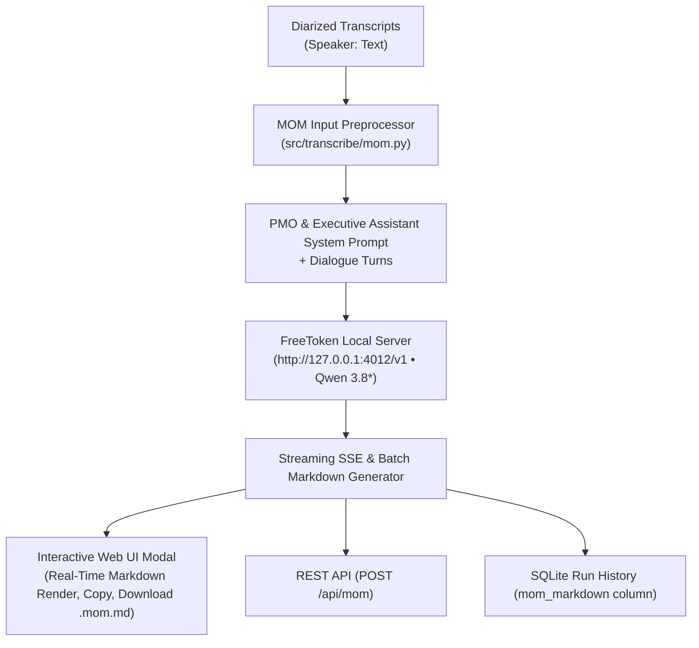

# Plan: FreeToken & Qwen 3.8* Minutes of Meeting (MOM) Executive Synthesis Engine

> **Status**: Completed / Active  
> **Target Version**: v0.7.0  
> **LLM Engine**: FreeToken (`ft serve`) hosting `Qwen/Qwen3.8-Flash-Next` on 2x NVIDIA L40 GPUs  
> **API Interface**: OpenAI-Compatible REST & SSE Streaming  

---

## 1. Executive Summary & Goals

Transform raw multi-speaker transcriptions into structured, actionable, and executive-ready **Minutes of Meeting (MOM)** documents. The system leverages the high-throughput local **FreeToken** engine running `Qwen/Qwen3.8-Flash-Next` on local GPU hardware (2x NVIDIA L40, 96 GB VRAM) to synthesize structured summaries, decision logs, and accountability matrices without relying on external cloud APIs or recurring token costs.



---

## 2. System Architecture & Components

### 2.1 Backend Core: `src/transcribe/mom.py`
- **Transcript Preprocessor**: Aggregates contiguous speaker turns into a formatted dialogue script (`Speaker: Text`).
- **Prompt Formulation**: Embeds the standard PMO / Executive Assistant system instructions.
- **OpenAI-Compatible Client**: Queries `LLM_BASE_URL` (`http://127.0.0.1:4012/v1`) using `httpx`.
- **Dual Invocation**:
  - `generate_mom_sync()`: Blocking completion returning the complete Markdown document.
  - `generate_mom_stream()`: Async generator yielding streaming Markdown chunks for real-time SSE.

### 2.2 System Prompt Specification
```markdown
# Role
You are an expert Executive Assistant and Project Management Officer (PMO). Your task is to analyze the raw meeting transcript provided earlier in this chat history and synthesize it into a highly structured, professional, and actionable Minutes of Meeting (MOM).

# Objectives
1. Reference the complete transcript provided in the previous message(s) of this conversation.
2. Filter out casual banter, filler words, and repetitive loops, focusing strictly on substance.
3. Maintain the professional context and technical accuracy of the discussion.
4. Clearly distinguish between facts, decisions, and proposed ideas.

# Output Format
## 1. Meeting Overview (Topic/Project, Date/Time, Key Attendees)
## 2. Executive Summary (Concise 3-4 sentence paragraph)
## 3. Detailed Discussion Points (Context, Key Perspectives, Resolution/Outcome per topic)
## 4. Key Decisions Made (Concrete bulleted list)
## 5. Action Items & Accountability (Markdown table: Task | Owner | Deadline)
## 6. Next Steps & Next Meeting
```

### 2.3 Storage & Persistence: `src/transcribe/history.py`
- Schema migration adding `mom_markdown TEXT DEFAULT NULL` to the `transcriptions` table.
- `save_history_mom(job_id, mom_text)` and `get_history_mom(job_id)`.

### 2.4 API Surface: `src/transcribe/server.py`
- `POST /api/mom`: Accepts `job_id`, `segments`, `model`, `stream`, and `temperature`.
  - When `stream: true`, emits Server-Sent Events (`data: {"chunk": "..."}`).
- `GET /api/history/{job_id}/mom`: Fetches cached MOM markdown for a previously completed job.

### 2.5 User Interface: `src/transcribe/web.py`
- **Timeline Export Toolbar**: Added `"📝 MOM"` button with dedicated amber styling.
- **Modal Dialog (`#mom-modal`)**:
  - Live SSE streaming text renderer.
  - Model and provider indicator (`FreeToken Qwen 3.8*`).
  - **1-Click Copy Markdown** to clipboard.
  - **Download `.mom.md`** file export.

---

## 3. Implementation Checklist & Verification

- [x] **[MOM-001]** Core preprocessor and LLM generator implemented in `src/transcribe/mom.py`.
- [x] **[MOM-002]** FreeToken configuration added to `.env` (`LLM_BASE_URL=http://127.0.0.1:4012/v1`, `LLM_MODEL=Qwen/Qwen3.8-Flash-Next`).
- [x] **[MOM-003]** Server REST & SSE streaming endpoints registered in `src/transcribe/server.py`.
- [x] **[MOM-004]** SQLite history persistence and schema migration implemented in `src/transcribe/history.py`.
- [x] **[MOM-005]** Web UI modal and export toolbar button added in `src/transcribe/web.py`.
- [x] **[MOM-006]** Unit tests created in `tests/test_mom.py` (6/6 tests passing).
- [x] **[MOM-007]** Cyclomatic complexity verified with average CC **4.31** (Grade A, all MOM routines $\le 8$).
- [x] **[MOM-008]** Systemd service `transcribe.service` restarted and verified active.

---

## 4. Operational Instructions

### Starting the FreeToken Local Server
```bash
cd /home/aiserver/LABS/FREETOKEN/FreeToken
./run-4012.sh Qwen/Qwen3.8-Flash-Next
```

### Managing the Transcribe Background Service
```bash
./scripts/service.sh status
./scripts/service.sh restart
./scripts/service.sh logs
```
